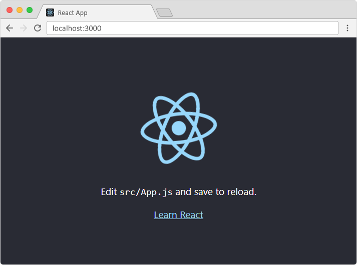

# What is React?

- React, sometimes referred to as a frontend JavaScript framework, is a JavaScript library created by Facebook.

- React is a tool for building UI components.

# How does React Work?

- React creates a VIRTUAL DOM in memory.

- Instead of manipulating the browser's DOM directly, React creates a virtual DOM in memory, where it does all the necessary manipulating, before making the changes in the browser DOM.

- React only changes what needs to be changed!

- React finds out what changes have been made, and changes only what needs to be changed.

# React.JS History

- Current version of React.JS is V18.0.0 (April 2022).

- Initial Release to the Public (V0.3.0) was in July 2013.

- React.JS was first used in 2011 for Facebook's Newsfeed feature.

- Facebook Software Engineer, <mark>Jordan Walke</mark>, created it.

- Current version of create-react-app is v5.0.1 (April 2022).

- create-react-app includes built tools such as webpack, Babel, and ESLint.

# React Directly in HTML

- The quickest way start learning React is to write React directly in your HTML files.

- Start by including three scripts, the first two let us write React code in our JavaScripts, and the third, Babel, allows us to write JSX syntax and ES6 in older browsers.

- You will learn more about JSX in the React JSX chapter.

Example

- Include three CDN's in your HTML file:

```
<!DOCTYPE html>
<html>
  <head>
    <script src="https://unpkg.com/react@18/umd/react.development.js" crossorigin></script>
    <script src="https://unpkg.com/react-dom@18/umd/react-dom.development.js" crossorigin></script>
    <script src="https://unpkg.com/@babel/standalone/babel.min.js"></script>
  </head>
  <body>

    <div id="mydiv"></div>

    <script type="text/babel">
      function Hello() {
        return <h1>Hello World!</h1>;
      }

      const container = document.getElementById('mydiv');
      const root = ReactDOM.createRoot(container);
      root.render(<Hello />)
    </script>

  </body>
</html>
```

- This way of using React can be OK for testing purposes, but for production you will need to set up a React environment.

# Setting up a React Environment

- If you have npx and Node.js installed, you can create a React application by using create-react-app.

- If you've previously installed create-react-app globally, it is recommended that you uninstall the package to ensure npx always uses the latest version of create-react-app.

- To uninstall, run this command:

  ```
   npm uninstall -g create-react-app.
  ```

- Run this command to create a React application named my-react-app:

  ```
    npx create-react-app my-react-app
  ```

- The create-react-app will set up everything you need to run a React application.

# Run the React Application

- Now you are ready to run your first real React application!

- Run this command to move to the my-react-app directory:

```
cd my-react-app
```

- Run this command to run the React application my-react-app:

```
npm start
```

- A new browser window will pop up with your newly created React App! If not, open your browser and type localhost:3000 in the address bar.

The result:


# Modify the React Application

- So far so good, but how do I change the content?

- Look in the my-react-app directory, and you will find a src folder. Inside the src folder there is a file called App.js, open it and it will look like this:

/myReactApp/src/App.js:

```
import logo from './logo.svg';
import './App.css';

function App() {
return (

<div className="App">
<header className="App-header">

<p>
Edit <code>src/App.js</code> and save to reload.
</p>
<a
          className="App-link"
          href="https://reactjs.org"
          target="_blank"
          rel="noopener noreferrer"
        >
Learn React
</a>
</header>
</div>
);
}

export default App;
```

- Try changing the HTML content and save the file.

- Notice that the changes are visible immediately after you save the file, you do not have to reload the browser!

```
Example
Replace all the content inside the <div className="App"> with a <h1> element.

See the changes in the browser when you click Save.

function App() {
return (

<div className="App">
<h1>Hello World!</h1>
</div>
);
}

export default App;
```

- Notice that we have removed the imports we do not need (logo.svg and App.css).

The result:


# What's Next?

- In the rest of this tutorial we will use our "Show React" tool to explain the various aspects of React, and how they are displayed in the browser.

- If you want to follow the same steps on your computer, start by stripping down the src folder to only contain one file: index.js. You should also remove any unnecessary lines of code inside the index.js file to make them look like the example in the "Show React" tool below:

```
Example
index.js:

import React from 'react';
import ReactDOM from 'react-dom/client';

const myFirstElement = <h1>Hello React!</h1>

const root = ReactDOM.createRoot(document.getElementById('root'));
root.render(myFirstElement);

```

# Upgrade React

- Upgrade to React 18
- Upgrading an existing React application to version 18 only requires two steps.

- If you are already using the latest version of create-react-app which uses React version 18 you can skip this section.

## Step 1: Install React 18

- To install the latest version, from your project folder run the following from the terminal:

```
npm i react@latest react-dom@latest
```

## Step 2: Use the new root API

- In order to take advantage of React 18's concurrent features you'll need to use the new root API for client rendering.

```
// Before
import ReactDOM from 'react-dom';
ReactDOM.render(<App />, document.getElementById('root'));
```

```
// After
import ReactDOM from 'react-dom/client';
const root = ReactDOM.createRoot(document.getElementById('root'));
root.render(<App />);
```

- You're application will work without using the new root API. If you continue to use ReactDOM.render your application will behave like React 17.
