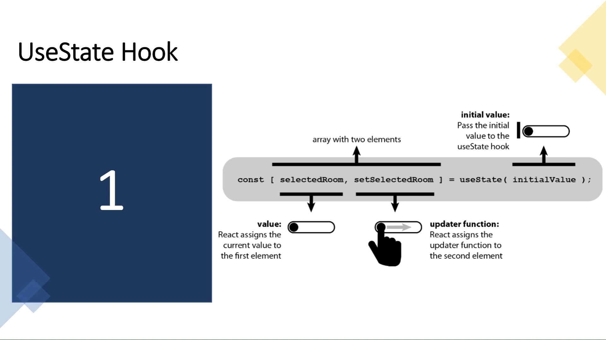

# useState :

- To manage states. Returns a stateful value and an updater function to update it.
- The React useState Hook allows us to track state in a function component.
- State generally refers to data or properties that need to be tracking in an application.
- useState lets you use local state within a function component. You pass the initial state to this function and it returns a variable with the current state value (not necessarily the initial state) and another function to update this value.

## Import useState

- To use the useState Hook, we first need to import it into our component.

Example : Get your own React.js Server

- At the top of your component, import the useState Hook.

```
import { useState } from "react";
```

<mark>Notice</mark> that we are destructuring useState from react as it is a named export.

## Declare state variable

- Declaring a state variable is as simple as calling useState with some initial state value, like so: useState(initialStateValue).

```
const DeclareStateVar = () => {
  const [count] = useState(100)
  return <div> State variable is {count}</div>
}
```

- Updating a state variable is as simple as invoking the updater function returned by the useState invocation: const [stateValue, updaterFn] = useState(initialStateValue);.

# Initialize useState



- We initialize our state by calling useState in our function component.

- useState accepts an initial state and returns two values:

  - The current state.
  - A function that updates the state.

```
import { useState } from "react";

function FavoriteColor() {
  const [color, setColor] = useState("");
}
```

<mark>Notice</mark> that again, we are destructuring the returned values from useState.

- The first value, color, is our current state.

- The second value, setColor, is the function that is used to update our state.

<mark>Note :</mark>These names are variables that can be named anything you would like.

- Lastly, we set the initial state to an empty string: useState("")

# Update State

- To update our state, we use our state updater function.
- We should never directly update state. Ex: color = "red" is not allowed.

```
Example:
Use a button to update the state:

import { useState } from "react";
import ReactDOM from "react-dom/client";

function FavoriteColor() {
  const [color, setColor] = useState("red");

  return (
    <>
      <h1>My favorite color is {color}!</h1>
      <button
        type="button"
        onClick={() => setColor("blue")}
      >Blue</button>
    </>
  )
}

const root = ReactDOM.createRoot(document.getElementById('root'));
root.render(<FavoriteColor />);
```

- Note how the age state variable is being updated.

```
const UpdateStateVar = () => {
  const [age, setAge] = useState(19)
  const handleClick = () => setAge(age + 1)

  return (
    <div>
      Today I am {age} Years of Age
      <div>
        <button onClick={handleClick}>Get older! </button>
      </div>
    </div>
  )
}
```

## Why does the React useState Hook not update immediately?

- If you find that useState/setState are not updating immediately, the answer is simple: they’re just queues.

- React useState and setState don’t make changes directly to the state object; they create queues to optimize performance, which is why the changes don’t update immediately.

## React Hooks and multiple state variables

- Multiple state variables may be used and updated from within a functional component, as shown below:

```
onst MultipleStateVars = () => {
  const [age, setAge] = useState(19)
  const [siblingsNum, setSiblingsNum] =
    useState(10)

  const handleAge = () => setAge(age + 1)
  const handleSiblingsNum = () =>
      setSiblingsNum(siblingsNum + 1)


  return (
    <div>
      <p>Today I am {age} Years of Age</p>
      <p>I have {siblingsNum} siblings</p>

      <div>
        <button onClick={handleAge}>
          Get older!
        </button>
        <button onClick={handleSiblingsNum}>
            More siblings!
        </button>
      </div>
    </div>
  )
}
```

## What Can State Hold

- The useState Hook can be used to keep track of strings, numbers, booleans, arrays, objects, and any combination of these!

Example:

- Create multiple state Hooks:

```
import { useState } from "react";
import ReactDOM from "react-dom/client";

function Car() {
  const [brand, setBrand] = useState("Ford");
  const [model, setModel] = useState("Mustang");
  const [year, setYear] = useState("1964");
  const [color, setColor] = useState("red");

  return (
    <>
      <h1>My {brand}</h1>
      <p>
        It is a {color} {model} from {year}.
      </p>
    </>
  )
}

const root = ReactDOM.createRoot(document.getElementById('root'));
root.render(<Car />);
```

- Or, we can just use one state and include an object instead!

```
//Create a single Hook that holds an object:

import { useState } from "react";
import ReactDOM from "react-dom/client";

function Car() {
  const [car, setCar] = useState({
    brand: "Ford",
    model: "Mustang",
    year: "1964",
    color: "red"
  });

  return (
    <>
      <h1>My {car.brand}</h1>
      <p>
        It is a {car.color} {car.model} from {car.year}.
      </p>
    </>
  )
}

const root = ReactDOM.createRoot(document.getElementById('root'));
root.render(<Car />);
```

# Use object state variable

- As opposed to strings and numbers, you could also use an object as the initial value passed to useState.

<mark>Note</mark> that you have to pass the entire object to the useState updater function because the object is replaced, not merged.

```
// 🐢 setState (object merge) vs useState (object replace)
// assume initial state is {name: "Ohans"}

setState({ age: 'unknown' })
// new state object will be
// {name: "Ohans", age: "unknown"}

useStateUpdater({ age: 'unknown' })
// new state object will be
// {age: "unknown"} - initial object is replaced
```

Example is :

```
const StateObject = () => {
  const [state, setState] = useState({ age: 19, siblingsNum: 4 })
  const handleClick = val =>
    setState({
      ...state,
      [val]: state[val] + 1
    })
  const { age, siblingsNum } = state

  return (
    <div>
      <p>Today I am {age} Years of Age</p>
      <p>I have {siblingsNum} siblings</p>

      <div>
        <button onClick={handleClick.bind(null, 'age')}>Get older!</button>
        <button onClick={handleClick.bind(null, 'siblingsNum')}>
          More siblings!
        </button>
      </div>
    </div>
  )
}
```

## Updating Objects and Arrays in State

- When state is updated, the entire state gets overwritten.
- What if we only want to update the color of our car?
- If we only called <mark>setCar({color: "blue"})</mark>, this would remove the brand, model, and year from our state.

We can use the JavaScript spread operator to help us.

Example:
Use the JavaScript spread operator to update only the color of the car:

```
import { useState } from "react";
import ReactDOM from "react-dom/client";

function Car() {
  const [car, setCar] = useState({
    brand: "Ford",
    model: "Mustang",
    year: "1964",
    color: "red"
  });

  const updateColor = () => {
    setCar(previousState => {
      return { ...previousState, color: "blue" }
    });
  }

  return (
    <>
      <h1>My {car.brand}</h1>
      <p>
        It is a {car.color} {car.model} from {car.year}.
      </p>
      <button
        type="button"
        onClick={updateColor}
      >Blue</button>
    </>
  )
}

const root = ReactDOM.createRoot(document.getElementById('root'));
root.render(<Car />);
```

- Because we need the current value of state, we pass a function into our setCar function. This function receives the previous value.

- We then return an object, spreading the previousState and overwriting only the color.
